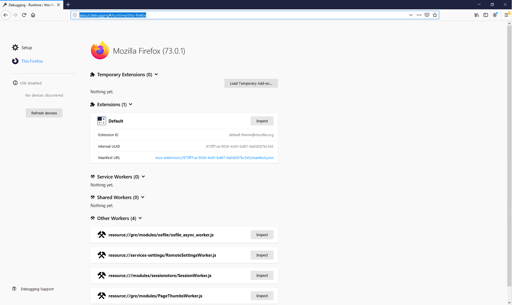
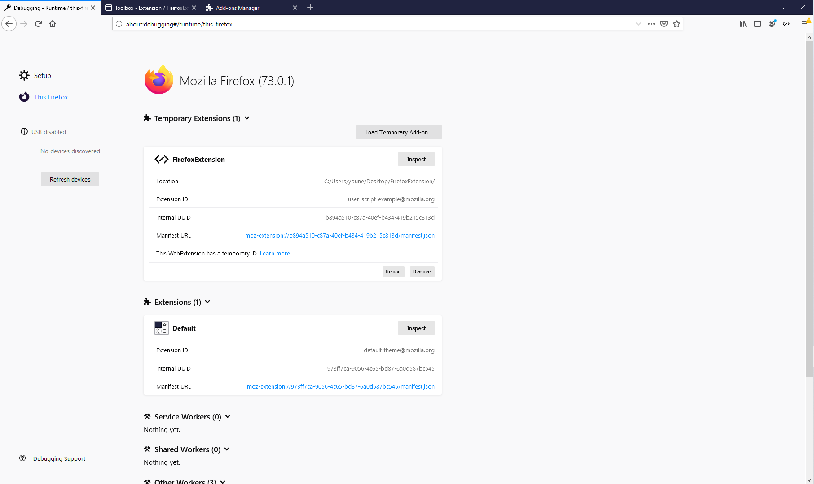
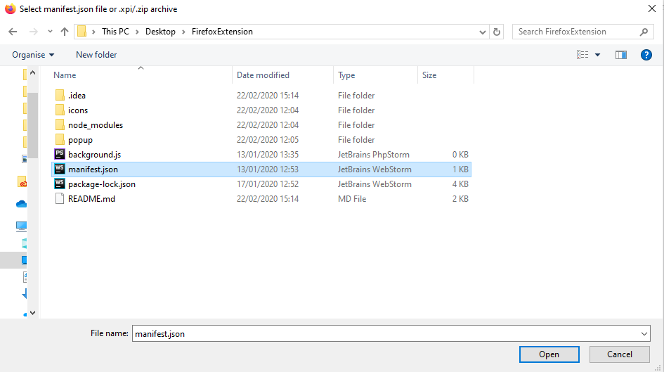
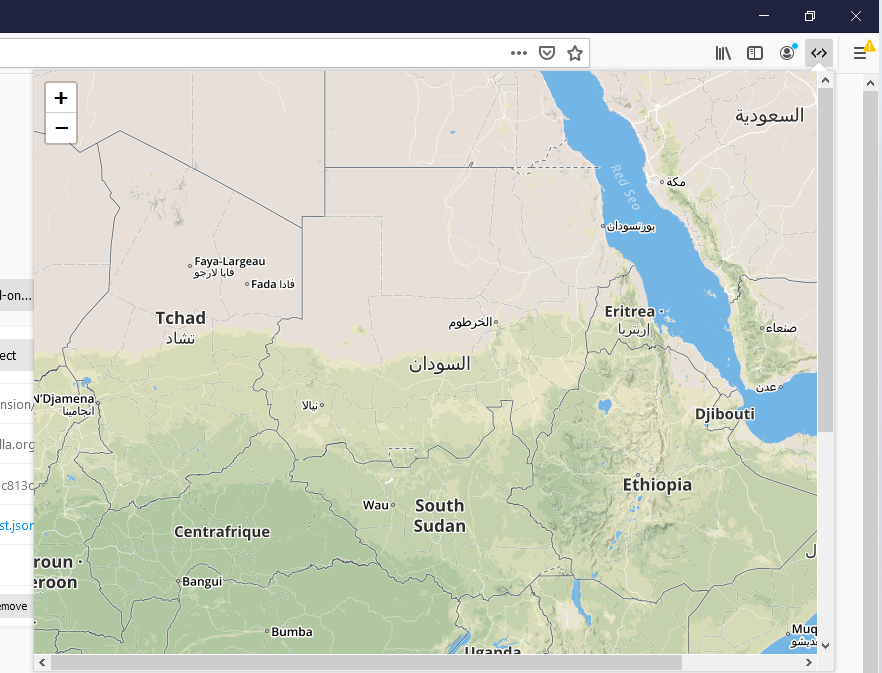
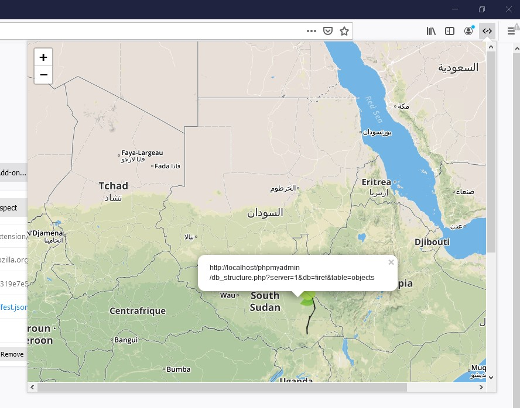
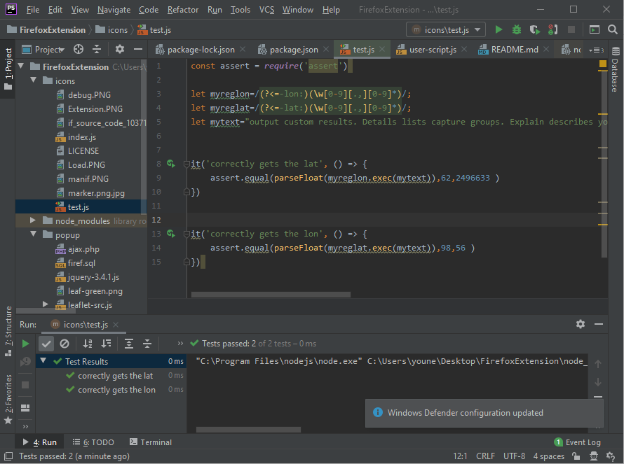

# Manuel d'utilisateur

Cette extension permet la l'ajout et la visualisation des `Marker` pour chaque `Bookmark` ajouté au navigateur.

L'extension permet d'éxecuter l'action sur des `Bookmark` dejà géolocalisés, c'est à dire qui ont une information qui renseigne la position géographique
sous forme de latitude et longitude en degrés.

Les `Marker` cartographiés génère des popups contenant l'`URL` de la page correspondante et qui sont cliquable pour ouvrir cette page dans un nouvel onglet.

Le code de l'application permet aussi de faire des tests sur des `Marker` stockés en une base de données, des `Markers` en fichier texte ou, par defaut, sur 
des `Markers` qui contienne l'information requise sous forme d'un `String` associé à l'attribut `Name` grace à une expression régulière.

# Guide d'installation

Le fichier le plus intéressant pour cette étape est le `manifest.json` qui se situe dans la racine du projet.

Pour pouvoir lancer et le test et l'extension il faut configurer le coté `Backend` et pour le faire on doit:

* Copier le dossier `FirefoxExtension` dans un serveur local par exemple: `..\XAMPP\htdocs`

* Avec un SGBD créer un base de données de test `firef` et lançer la requete dans le fichier: `..\FirefoxExtension\popup\firef.sql`

* Lancer le navigateur Firefox accéder à: `about:debugging`

* Clicker sur le bouton: `Load Temporary Add-on` 

* Ouvrir le fichier `manifest.json` 

* Accéder à l'extension: 

* Faire un hover sur le `Marker` et cliquer sur le popup pour l'ouvrir 


# Guide dev:

L'approche par titre se base su l'extraction de longitude et latitude qui sont sous la forme :
* "texte + -lon: + `float1` + -lat + `float2` + text"

Cette extraction se base sur les expressions regulières:
```javascript 
let myreg=/(?<=-lon:)(\w[0-9][.,][0-9]*)/;

let lon=parseFloat(myreg.exec("text"));
```
L'expression ci-dessus permet d'extraire `float1` et de meme pour `float2` avec `text` le nom du `Bookmark` recupéré depuis l'API [Bookmark API](https://developer.mozilla.org/en-US/docs/Mozilla/Add-ons/WebExtensions/API/bookmarks) :
```javascript 
let myreg=/(?<=-lat:)(\w[0-9][.,][0-9]*)/;

let lat=parseFloat(myreg.exec("text"));
```

Les tests unitaires associés sont faits par `mocha` dans le `Backend` grace à `Nodejs` comme le montre l'illustration suivante 


